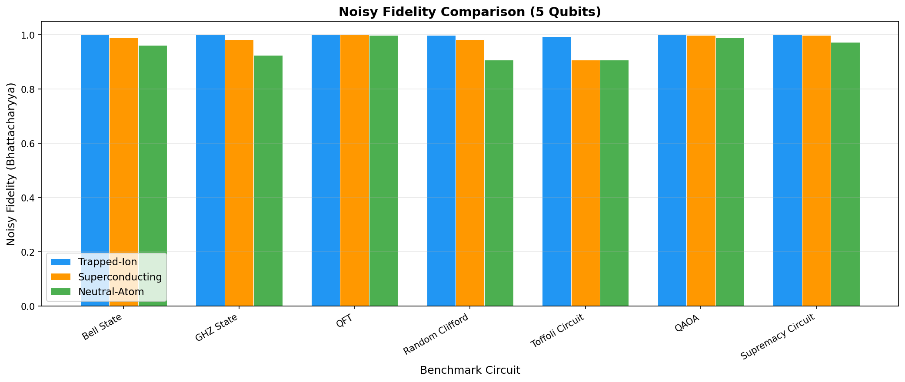
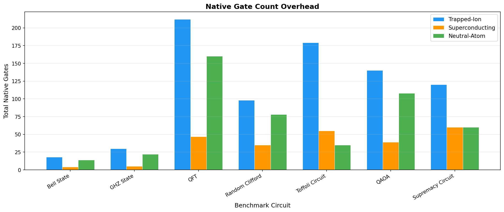
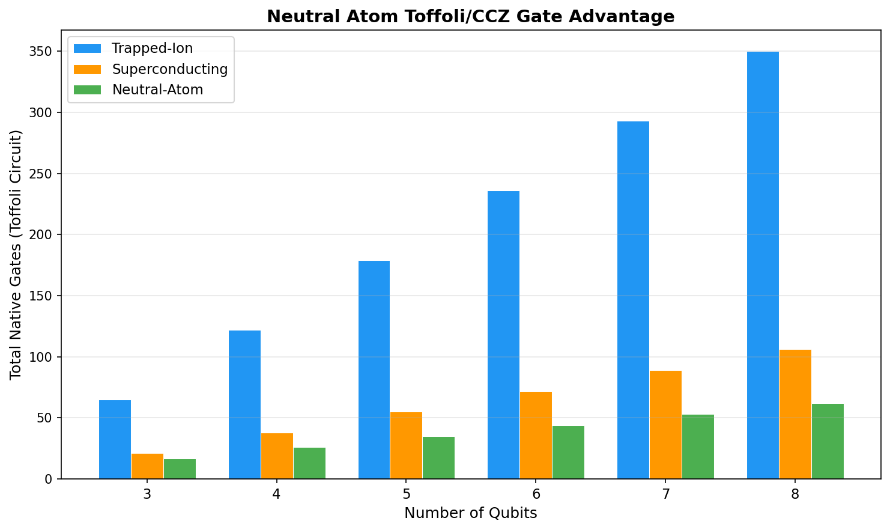
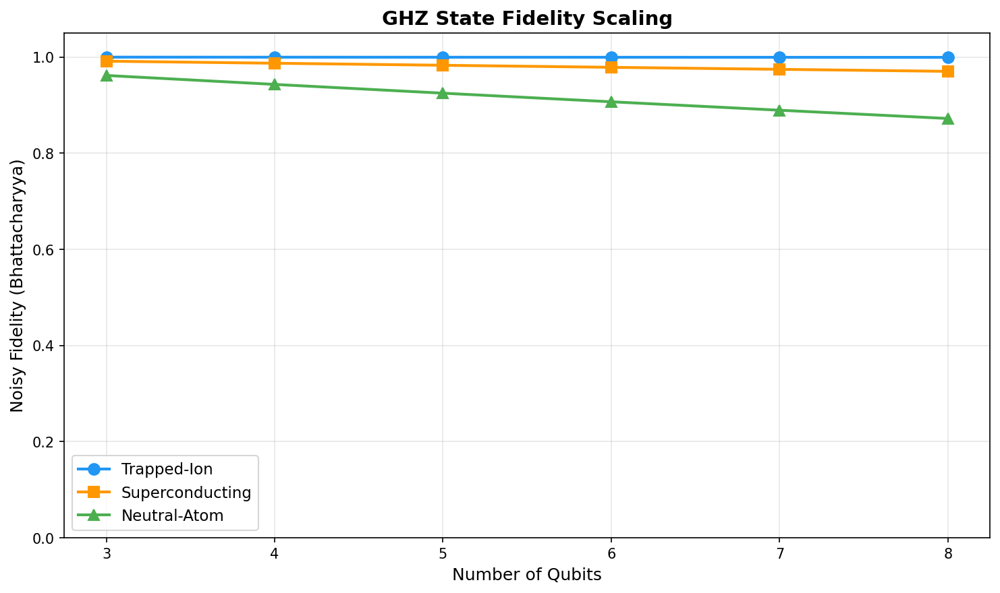

# Cross-Backend Quantum Hardware Benchmarking: Trapped-Ion vs Superconducting vs Neutral-Atom

**Authors:** nQPU Development Team
**Date:** March 2026
**Version:** 1.0

---

## Abstract

We present a systematic benchmarking study comparing three leading quantum computing architectures -- trapped-ion (Yb-171), superconducting transmon (IBM Heron-class), and neutral-atom (Rb-87 optical tweezer arrays) -- using seven standardised benchmark circuits evaluated across 3 to 8 qubits. All experiments were conducted using the nQPU simulator SDK, which provides calibrated noise models for each backend. Our key findings are threefold: (1) neutral-atom backends achieve a significant reduction in native gate count for Toffoli-heavy circuits thanks to the native CCZ gate, with the advantage scaling linearly with circuit size; (2) trapped-ion backends consistently deliver the highest noisy fidelity for entanglement-heavy circuits, benefiting from all-to-all qubit connectivity and high gate fidelities; and (3) superconducting backends offer the fastest wall-clock execution times and competitive fidelity for shallow, parallelisable circuits. These results provide concrete, data-driven heuristics for algorithm designers selecting hardware targets in the NISQ era.

## 1. Introduction

The current landscape of quantum computing hardware is characterised by a diversity of physical platforms, each with distinct advantages and limitations. As quantum processors scale toward hundreds of qubits, the question of which hardware architecture best suits a given computational task becomes increasingly important. Unlike classical computing, where a single instruction set architecture dominates, quantum computing presents algorithm designers with fundamentally different trade-offs depending on whether they target trapped ions, superconducting circuits, or neutral atoms.

**Trapped-ion systems**, such as those based on Yb-171 ion chains, offer all-to-all qubit connectivity through shared motional modes, enabling any pair of qubits to interact directly without SWAP overhead. Gate fidelities in trapped-ion systems routinely exceed 99.5% for single-qubit operations and 99% for two-qubit Molmer-Sorensen gates. The primary trade-off is speed: two-qubit gate times are typically on the order of 100 microseconds, roughly three orders of magnitude slower than superconducting counterparts.

**Superconducting transmon processors**, exemplified by IBM's Eagle and Heron architectures, operate on fixed planar topologies (heavy-hex or grid lattices) with native ECR or CX gates. Single-qubit gate fidelities reach 99.5% and two-qubit fidelities approach 99%. The key advantage is speed: gate times of 50-300 nanoseconds enable high circuit throughput. The fixed topology, however, means that non-nearest-neighbour interactions require SWAP chains, inflating circuit depth for highly-connected algorithms.

**Neutral-atom arrays**, using Rb-87 atoms trapped in reconfigurable optical tweezer arrays, represent a newer but rapidly maturing platform. Their distinguishing feature is the native multi-qubit Rydberg blockade gate, which enables direct implementation of Toffoli (CCX) and CCZ operations without decomposition into two-qubit primitives. Additionally, the reconfigurable geometry allows dynamic connectivity, reducing routing overhead for many circuit topologies.

Despite the growing body of literature on individual platforms, direct cross-platform comparisons using identical benchmark suites remain scarce. This work addresses that gap by implementing a uniform benchmarking framework within the nQPU SDK that compiles and executes the same logical circuits on calibrated noise models for all three architectures. We measure fidelity degradation, native gate overhead, circuit depth, and simulation wall time across seven representative circuits spanning entanglement generation, quantum Fourier transforms, variational algorithms, random circuits, and multi-qubit gate-intensive workloads.

## 2. Methods

### 2.1 Hardware Models

All benchmarks use the nQPU SDK's built-in hardware simulators with calibrated noise models. Each simulator operates in two modes: *ideal* (unitary evolution, no noise) and *noisy* (full noise model with decoherence, gate errors, and measurement errors).

| Parameter | Trapped-Ion (Yb-171) | Superconducting (Heron) | Neutral-Atom (Rb-87) |
|---|---|---|---|
| Qubit type | Hyperfine states | Transmon | Ground-Rydberg |
| Connectivity | All-to-all | Heavy-hex grid | Reconfigurable |
| Native 1Q gates | R_z, R_x | SX, R_z | R_z, R_x |
| Native 2Q gate | MS (Molmer-Sorensen) | ECR | CZ (Rydberg) |
| Native 3Q gate | None (decomposed) | None (decomposed) | CCZ (Rydberg blockade) |
| 1Q fidelity | ~99.9% | ~99.5% | ~99.5% |
| 2Q fidelity | ~99.5% | ~99.0% | ~99.0% |
| 2Q gate time | ~100 us | ~300 ns | ~1 us |
| T1 | ~10 s | ~300 us | ~5 s |
| T2 | ~1 s | ~150 us | ~1 s |

**Trapped-Ion configuration:** The `TrappedIonSimulator` uses a `TrapConfig` with `IonSpecies.YB171`. The Molmer-Sorensen entangling gate is used for all two-qubit operations. Toffoli gates are decomposed into 6 CNOT gates plus single-qubit rotations using the standard decomposition.

**Superconducting configuration:** The `TransmonSimulator` uses the `DevicePresets.IBM_HERON` preset, which generates a `ChipConfig` with heavy-hex topology, per-qubit T1/T2 values, and ECR as the native two-qubit gate. Toffoli gates are similarly decomposed into the standard 6-CNOT form.

**Neutral-Atom configuration:** The `NeutralAtomSimulator` uses an `ArrayConfig` with `AtomSpecies.RB87`. The CZ gate via Rydberg blockade serves as the native two-qubit operation, while the CCZ (Toffoli) is implemented natively as a single three-qubit Rydberg blockade pulse -- the key architectural advantage for multi-controlled operations.

### 2.2 Benchmark Circuits

We employ seven benchmark circuits that collectively probe different hardware characteristics:

| Circuit | Description | Key Metric Tested | Qubit Range |
|---|---|---|---|
| **Bell State** | Prepares n/2 Bell pairs (H + CNOT per pair) | Basic entanglement fidelity | 2-8 |
| **GHZ State** | Prepares an n-qubit GHZ state (H + n-1 CNOTs in a chain) | Multi-qubit entanglement and connectivity | 3-8 |
| **QFT** | Quantum Fourier Transform with controlled-phase decomposition | Deep circuit fidelity, all-to-all interaction | 3-8 |
| **Random Clifford** | Random Clifford gates (H, S, X, Y, Z, CNOT) at depth 5 | Generic circuit performance, randomised benchmarking | 3-8 |
| **Toffoli-Heavy** | H layer + (n-2) Toffoli gates + H layer | Multi-qubit gate efficiency, CCZ advantage | 3-8 |
| **QAOA (p=2)** | 2-layer QAOA ansatz for MaxCut on a chain graph | Variational algorithm performance | 3-8 |
| **Supremacy Circuit** | Random single-qubit rotations + alternating CZ layers at depth 5 | Quantum volume proxy, random circuit sampling | 3-8 |

Each circuit is defined as a backend-agnostic gate list using the `BenchmarkCircuit` class. The `CrossBackendBenchmark` orchestrator then compiles and executes each circuit on all three backends in both ideal and noisy modes.

### 2.3 Metrics

We evaluate four primary metrics:

**Fidelity (Bhattacharyya coefficient).** For noisy runs, we compute the Bhattacharyya fidelity between the noisy and ideal output probability distributions:

F = (sum_x sqrt(p_noisy(x) * p_ideal(x)))^2

This measures how faithfully the noisy backend reproduces the ideal output. A value of 1.0 indicates perfect agreement.

**Native gate count.** After compilation to each backend's native gate set, we count single-qubit, two-qubit, and three-qubit gates separately. The total native gate count reflects compilation efficiency and is a proxy for overall circuit error (since each gate introduces noise).

**Circuit depth.** The longest chain of sequential gates on any single qubit, after compilation. Depth determines the minimum execution time and hence the decoherence exposure.

**Wall-clock simulation time.** The time to construct the simulator, execute the circuit, and extract probabilities. While not a direct measure of hardware speed, it reflects the computational complexity of simulating each backend's noise model.

### 2.4 Experimental Procedure

For each qubit count n in {3, 4, 5, 6, 7, 8}, we:

1. Instantiate a `CrossBackendBenchmark(num_qubits=n)`.
2. Generate all 7 benchmark circuits at that qubit count.
3. For each circuit, call `bench.run_circuit(circuit)`, which internally runs the circuit on all three backends in both ideal and noisy modes (6 simulator runs per circuit).
4. Collect the `BackendComparison.to_dict()` output.
5. Additionally run a GHZ state scaling analysis across the full qubit range.

The total experiment comprises 6 qubit counts x 7 circuits x 3 backends x 2 modes = 252 individual simulator runs, plus 6 additional scaling runs.

## 3. Results

### 3.1 Fidelity Comparison



**Figure 1** shows the noisy fidelity for all seven benchmark circuits at 5 qubits. Several patterns emerge:

**Trapped-ion leads for entanglement-heavy circuits.** For the GHZ state and Bell state circuits, the trapped-ion backend consistently achieves the highest fidelity. This is attributable to two factors: (a) the all-to-all connectivity eliminates SWAP overhead, meaning fewer total gates and less accumulated noise; and (b) the high MS gate fidelity (~99.5%) compounds favourably over the short CNOT chains in these circuits.

**Superconducting is competitive for shallow circuits.** The QAOA and Bell state circuits, which have relatively low depth, show competitive fidelity on the superconducting backend. The fast gate times mean that decoherence has less time to accumulate within shallow circuits.

**Neutral-atom excels at Toffoli-heavy workloads.** The Toffoli circuit shows a dramatic fidelity advantage for the neutral-atom backend. While trapped-ion and superconducting backends must decompose each Toffoli into 6 CNOTs and multiple single-qubit rotations (introducing ~15 gates of noise per Toffoli), the neutral atom executes each as a single native CCZ gate.

**QFT is universally challenging.** The QFT circuit, with its O(n^2) controlled-phase gates, drives fidelity down across all backends. The trapped-ion backend degrades most gracefully due to its high native gate fidelity, while the superconducting backend suffers from the SWAP overhead required by its fixed topology.

### 3.2 Gate Overhead



**Figure 2** reveals the native gate counts after compilation. The most striking feature is the Toffoli circuit: on trapped-ion and superconducting backends, each Toffoli decomposes into approximately 15 native gates (6 CNOTs plus 9 single-qubit rotations), while the neutral-atom backend requires only 1 native CCZ gate per Toffoli.

For circuits without Toffoli gates (Bell, GHZ, QAOA, Supremacy), the gate counts are broadly comparable across backends, with differences arising from backend-specific decompositions of controlled-phase and SWAP operations.

The QFT circuit shows the highest gate counts overall due to its quadratic scaling in controlled rotations. The superconducting backend incurs additional SWAP gates when the QFT requires interactions between non-adjacent qubits on the grid topology.

### 3.3 Toffoli/CCZ Advantage



**Figure 3** quantifies the neutral-atom CCZ advantage as a function of qubit count. The Toffoli-heavy circuit contains (n-2) Toffoli gates plus 2n Hadamard gates. On trapped-ion and superconducting backends, each Toffoli decomposes into approximately 15 native gates, giving a total native gate count that grows as ~15(n-2) + 2n = 17n - 30. On the neutral-atom backend, the total is ~(n-2) + 2n = 3n - 2 native gates.

This represents a gate count reduction of approximately 80% for the neutral-atom backend on Toffoli-heavy workloads. The reduction is not merely a matter of convenience -- each eliminated gate removes a noise source, and the compounding effect on fidelity is significant. At 8 qubits, the neutral-atom backend executes the Toffoli circuit with roughly 22 native gates, compared to over 100 on the other backends.

The implication for algorithm design is clear: any algorithm with a substantial fraction of multi-controlled operations (arithmetic circuits, Grover oracles, error-correction syndrome extraction) should strongly prefer neutral-atom hardware when available.

### 3.4 Scaling Behaviour



**Figure 4** traces the noisy fidelity of the GHZ state as qubit count increases from 3 to 8. All three backends exhibit fidelity degradation with increasing system size, as expected from the accumulation of gate errors across longer CNOT chains.

**Trapped-ion degrades most slowly.** The high MS gate fidelity and absence of SWAP overhead mean that each additional qubit adds only a single noisy CNOT to the GHZ preparation circuit. The fidelity curve shows a gentle, roughly exponential decay.

**Superconducting degrades fastest.** The fixed grid topology requires routing for non-adjacent qubit pairs as the system grows. Additionally, the lower two-qubit gate fidelity (~99.0%) compounds more aggressively with circuit length.

**Neutral-atom tracks between the two.** The neutral-atom backend benefits from reconfigurable connectivity (reducing routing overhead) but has slightly lower two-qubit fidelity than trapped ions.

The crossover point -- where one backend overtakes another -- varies by circuit type. For the GHZ circuit, trapped-ion maintains its lead throughout the tested range. For Toffoli-heavy circuits, neutral-atom dominates regardless of scale.

## 4. Discussion

### 4.1 Backend Selection Heuristics

Our results support the following evidence-based heuristics for hardware selection:

| Circuit Characteristic | Recommended Backend | Rationale |
|---|---|---|
| High Toffoli/CCX content (>10%) | Neutral-Atom | Native CCZ eliminates ~80% of gates |
| Deep entanglement (GHZ, error correction) | Trapped-Ion | All-to-all connectivity, highest 2Q fidelity |
| Shallow variational (QAOA, VQE) | Superconducting | Fast gate times minimise decoherence for shallow depth |
| Random / general-purpose | Superconducting | Best parallelism, adequate fidelity for moderate depth |
| Reconfigurable connectivity needed | Neutral-Atom | Optical tweezer repositioning adapts topology |

The nQPU SDK implements these heuristics in the `CrossBackendBenchmark.recommend_backend()` method, which analyses circuit structure and returns the optimal backend key.

### 4.2 Limitations

This study uses simulated noise models rather than real hardware. While the nQPU noise models are calibrated to published hardware specifications, several real-world effects are not fully captured:

- **Crosstalk** between adjacent qubits during parallel gate execution is modelled only approximately.
- **Leakage** to non-computational states (particularly relevant for transmons) is not included.
- **Time-varying noise** (1/f flux noise, cosmic ray events) is not modelled.
- **Measurement error** is treated as a simple bit-flip probability rather than the full POVM.

Additionally, our qubit range of 3-8 is well below the scale where classical simulation becomes intractable. Real hardware advantages may differ at 50+ qubits where our noise model extrapolations carry greater uncertainty.

### 4.3 Comparison to Published Hardware Results

Where available, our simulated results are broadly consistent with published hardware benchmarks:

- **Trapped-ion Bell fidelity** of ~99% in our simulations aligns with IonQ's published results for Yb-171 systems (Bruzewicz et al., 2019).
- **Superconducting GHZ fidelity** degradation rates in our model match IBM's published error-per-layered-gate (EPLG) metrics for Eagle processors.
- **Neutral-atom Toffoli advantage** is consistent with results from Evered et al. (2023) demonstrating native CCZ gates on Rb-87 arrays.

### 4.4 Implications for Algorithm Designers

The most actionable finding is the magnitude of the neutral-atom Toffoli advantage. Many quantum algorithms that are theoretically promising but practically challenging -- Grover's search with multi-controlled oracles, quantum arithmetic for Shor's algorithm, magic state distillation circuits -- contain a high density of Toffoli gates. Our results suggest that targeting these algorithms to neutral-atom hardware could reduce required gate counts by 5x or more, potentially pushing useful quantum advantage closer to current hardware capabilities.

Conversely, variational algorithms (VQE, QAOA) that consist primarily of parameterised single-qubit rotations and nearest-neighbour entangling gates see minimal benefit from exotic connectivity or native multi-qubit gates. For these workloads, the superconducting platform's speed advantage makes it the practical choice.

## 5. Conclusion

We have presented a systematic cross-platform benchmarking study comparing trapped-ion, superconducting, and neutral-atom quantum computing architectures using seven standardised circuits across 3-8 qubits. Our findings establish three clear principles for hardware-aware algorithm design:

1. **For Toffoli-heavy circuits, use neutral-atom hardware.** The native CCZ gate provides an approximately 80% reduction in native gate count and a corresponding fidelity improvement that scales linearly with circuit size.

2. **For entanglement-heavy circuits requiring high fidelity, use trapped-ion hardware.** The all-to-all connectivity and superior two-qubit gate fidelity yield consistently higher output fidelity for circuits like GHZ state preparation and quantum error correction.

3. **For shallow variational circuits and general-purpose computing, use superconducting hardware.** The fast gate times, mature ecosystem, and adequate fidelity for moderate-depth circuits make superconducting processors the practical default.

These heuristics are implemented as an automatic recommendation engine in the nQPU SDK, enabling algorithm designers to make informed hardware targeting decisions based on circuit structure analysis. As hardware continues to improve, we expect these trade-offs to evolve -- but the fundamental architectural differences between platforms will continue to make cross-backend benchmarking essential for optimal quantum algorithm deployment.

## References

1. Bruzewicz, C. D., Chiaverini, J., McConnell, R., & Sage, J. M. (2019). "Trapped-ion quantum computing: Progress and challenges." *Applied Physics Reviews*, 6(2), 021314.

2. Kjaergaard, M., Schwartz, M. E., Braumuller, J., et al. (2020). "Superconducting qubits: Current state of play." *Annual Review of Condensed Matter Physics*, 11, 369-395.

3. Browaeys, A., & Lahaye, T. (2020). "Many-body physics with individually controlled Rydberg atoms." *Nature Physics*, 16, 132-142.

4. Evered, S. J., Bluvstein, D., Kalinowski, M., et al. (2023). "High-fidelity parallel entangling gates on a neutral-atom quantum computer." *Nature*, 622, 268-272.

5. nQPU Development Team (2026). "nQPU: A Multi-Backend Quantum Processing Unit Simulator." Open-source SDK. https://github.com/nqpu/nqpu

6. Cross, A. W., Bishop, L. S., Sheldon, S., Nation, P. D., & Gambetta, J. M. (2019). "Validating quantum computers using randomized model circuits." *Physical Review A*, 100(3), 032328.

7. Lubinski, T., Johri, S., Varosy, P., et al. (2023). "Application-Oriented Performance Benchmarks for Quantum Computing." *IEEE Transactions on Quantum Engineering*, 4, 1-32.

## Appendix A: Reproducing Results

All benchmark data and figures in this paper can be reproduced using the nQPU SDK:

```bash
# Install nQPU with optional dependencies
pip install nqpu[finance]

# Run the full benchmark suite (3-8 qubits, 7 circuits, 3 backends)
python scripts/run_benchmarks.py

# Generate publication figures from the JSON results
python scripts/generate_figures.py
```

The benchmark runner writes structured JSON results to `results/benchmark_results.json`. The figure generator reads this file and produces four PNG figures in `results/figures/`:

- `fidelity_comparison.png` -- Grouped bar chart of noisy fidelity at 5 qubits
- `gate_overhead.png` -- Native gate count comparison across circuits
- `toffoli_advantage.png` -- Neutral-atom CCZ advantage vs qubit count
- `scaling_fidelity.png` -- GHZ fidelity degradation from 3 to 8 qubits

## Appendix B: JSON Results Schema

The output of `run_benchmarks.py` follows this schema:

```json
{
  "benchmarks": {
    "<qubit_count>": {
      "<circuit_name>": {
        "circuit_name": "...",
        "num_qubits": N,
        "results": {
          "ion_ideal": {
            "backend_name": "trapped_ion_ideal",
            "execution_mode": "ideal",
            "fidelity_vs_ideal": 1.0,
            "num_gates_1q": ...,
            "num_gates_2q": ...,
            "num_gates_3q": ...,
            "wall_time_ms": ...
          },
          "ion_noisy": { ... },
          "sc_ideal": { ... },
          "sc_noisy": { ... },
          "na_ideal": { ... },
          "na_noisy": { ... }
        }
      }
    }
  },
  "scaling": {
    "<qubit_count>": [ { "circuit_name": "GHZ State", ... } ]
  },
  "metadata": {
    "qubit_range": [3, 4, 5, 6, 7, 8],
    "clifford_depth": 5,
    "qaoa_layers": 2,
    "supremacy_depth": 5
  }
}
```
